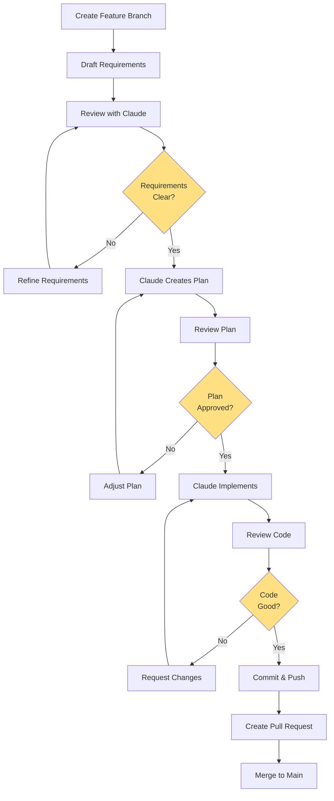

# Development Workflow with Claude Code

**Version:** 1.0
**Last Updated:** 2025-01-17
**Audience:** Developers working with AI agents (Claude Code)

---

## Table of Contents

1. [Overview](#overview)
2. [Workflow Phases](#workflow-phases)
3. [Step-by-Step Guide](#step-by-step-guide)
4. [Working in Plan Mode](#working-in-plan-mode)
5. [Best Practices](#best-practices)
6. [Examples](#examples)
7. [Troubleshooting](#troubleshooting)

---

## Overview

This document describes the recommended workflow for developing features in this codebase using Claude Code as your AI pair programmer. The workflow emphasizes:

- ✅ **Planning before coding** - Review and approve plans before implementation
- ✅ **Clear requirements** - Use structured templates for consistency
- ✅ **Iterative refinement** - Refine requirements and plans before committing
- ✅ **Clean git history** - One feature per branch, clear commit messages
- ✅ **Code review ready** - Well-documented changes with context

---

## Workflow Phases



### Phase Summary

| Phase | Duration | Deliverable | Reversible? |
|-------|----------|-------------|-------------|
| 1. Branch Creation | 1 min | New feature branch | Yes |
| 2. Requirements Drafting | 10-30 min | Requirements document | Yes |
| 3. Requirements Review | 5-15 min | Approved requirements | Yes |
| 4. Plan Creation | 5-10 min | Implementation plan | Yes |
| 5. Plan Review | 10-20 min | Approved plan | Yes |
| 6. Implementation | Varies | Working code | Yes (rollback) |
| 7. Code Review | 10-30 min | Reviewed code | Yes |
| 8. Commit & Push | 2 min | Committed code | Yes (revert) |
| 9. Pull Request | 5 min | PR for review | Yes |
| 10. Merge | 1 min | Code in main | No (revert only) |

---

## Step-by-Step Guide

### Step 1: Create Feature Branch

**From main branch:**

```bash
# Ensure main is up to date
git checkout main
git pull origin main

# Create feature branch with descriptive name
git checkout -b feature/dynamic-platform-selection

# Verify you're on new branch
git branch --show-current
```

**Branch Naming Convention:**
- `feature/` - New features
- `fix/` - Bug fixes
- `refactor/` - Code improvements
- `docs/` - Documentation only
- `test/` - Test additions/fixes

**Examples:**
```
feature/gitlab-mcp-integration
feature/confluence-adapter
fix/circuit-breaker-memory-leak
refactor/platform-registry-simplify
docs/api-documentation
test/integration-test-suite
```

### Step 2: Create Requirements Document

**Copy the template:**

```bash
# Create requirements directory if needed
mkdir -p docs/requirements

# Copy template
cp docs/requirements/TEMPLATE.md docs/requirements/my-feature.md
```

**Fill out the template** (see [Requirements Template](#requirements-template) section below).

### Step 3: Activate Claude Code Plan Mode

Open your terminal or Claude Code and say:

```
I want to work in plan mode.

Please read: docs/requirements/my-feature.md

Then:
1. Analyze the requirements
2. Create a detailed implementation plan
3. Show me the plan for review
4. Wait for my approval before implementing

Do NOT make any code changes yet.
```

### Step 4: Review Requirements with Claude

Claude will review your requirements and may ask clarifying questions:

**Claude might ask:**
- "Should the cache be in-memory or Redis?"
- "What's the max file size for uploads?"
- "Do we need backward compatibility?"

**You respond:**
```
Good questions:
1. Use in-memory cache for now (Redis in phase 2)
2. Max file size: 10MB
3. Yes, must be backward compatible

Please update the requirements doc and show me the changes.
```

**Iterate until requirements are clear.**

### Step 5: Review Implementation Plan

Claude will present a plan like:

```
# Implementation Plan: Dynamic Platform Selection

## Phase 1: Foundation (Week 1)

### Files to Create:
1. app/platforms/IPlatformAdapter.js (120 lines)
   - Abstract base class
   - Define interface methods
   - Add JSDoc documentation

2. app/platforms/PlatformRegistry.js (150 lines)
   - Singleton pattern
   - Registration methods
   - Event emitters

### Files to Modify:
1. app/discovery.js
   - Remove lines 50-61 (switch statement)
   - Replace with registry.getConfiguredPlatforms()
   - Reduction: ~420 lines

### Tests to Create:
1. tests/unit/platforms/PlatformRegistry.test.js
   - 20 test cases
   - 95% coverage target

## Success Criteria:
- [ ] All new files created
- [ ] Tests pass with 90%+ coverage
- [ ] No breaking changes to existing code

## Estimated Time: 1 week
```

### Step 6: Refine the Plan

**If you need changes:**

```
Good plan! A few adjustments:

Add:
- Health monitoring for platform availability
- Circuit breaker pattern for resilience

Change:
- Move PlatformRegistry to app/core/ instead of app/platforms/

Remove:
- Event emitters (YAGNI for now)

Please update the plan.
```

**Claude updates and shows revised plan.**

**Iterate until satisfied.**

### Step 7: Approve Plan and Begin Implementation

```
The plan looks great! Please proceed with implementation.

Work incrementally - after each file, show me what you created
so I can review before moving to the next.
```

### Step 8: Review Code as It's Created

Claude will create code and show you:

```
I've created app/platforms/IPlatformAdapter.js

[shows code]

Should I proceed to create PlatformRegistry.js?
```

**You review and respond:**
```
IPlatformAdapter looks good!

One change: Add a getVersion() method to the interface.

Then proceed to PlatformRegistry.js
```

### Step 9: Run Tests

After implementation:

```bash
# Run affected tests
npm test tests/unit/platforms/

# Run all tests
npm test

# Check coverage
npm test -- --coverage
```

**If tests fail:**
```
Tests are failing with error: [paste error]

Please fix the issue.
```

### Step 10: Review Final Code

```
Please show me a summary of all files created/modified.
```

Claude provides:

```
## Summary of Changes

### Files Created (3):
- app/platforms/IPlatformAdapter.js (125 lines)
- app/platforms/PlatformRegistry.js (180 lines)
- tests/unit/platforms/PlatformRegistry.test.js (250 lines)

### Files Modified (2):
- app/discovery.js (-420 lines, +25 lines)
- app/context.js (-100 lines, +15 lines)

### Total Changes:
- Lines added: 595
- Lines removed: 520
- Net change: +75 lines
```

### Step 11: Commit Changes

**Review staged changes:**

```bash
git status
git diff
```

**Commit with conventional commit format:**

```bash
git add .

git commit -m "feat: implement dynamic platform selection with registry pattern

Add platform adapter interface and registry for dynamic platform selection.

Changes:
- Create IPlatformAdapter abstract base class
- Create PlatformRegistry singleton for adapter management
- Refactor discovery.js to use registry instead of switch statements
- Add comprehensive unit tests (90% coverage)

Benefits:
- New platforms addable without core code changes
- Eliminates switch statement anti-pattern
- Improves maintainability and testability

BREAKING CHANGE: None (backward compatible)

🤖 Generated with [Claude Code](https://claude.com/claude-code)

Co-Authored-By: Claude <noreply@anthropic.com>"
```

**Push to remote:**

```bash
git push -u origin feature/dynamic-platform-selection
```

### Step 12: Create Pull Request

**Using GitHub CLI:**

```bash
gh pr create \
  --title "feat: Dynamic platform selection with registry pattern" \
  --body "$(cat <<'EOF'
## Summary
Implements dynamic platform selection using Strategy and Registry patterns.

## Changes
- ✅ Created IPlatformAdapter interface
- ✅ Created PlatformRegistry for adapter management
- ✅ Refactored discovery.js to eliminate switch statements
- ✅ Added comprehensive tests (90% coverage)

## Testing
- All unit tests pass
- Integration tests pass
- No breaking changes

## Documentation
- Updated CLAUDE.md with new architecture
- Added inline JSDoc comments
- Created architecture diagram

## Checklist
- [x] Tests added/updated
- [x] Documentation updated
- [x] No breaking changes
- [x] Follows coding standards

## Related Issues
Closes #123

🤖 Generated with [Claude Code](https://claude.com/claude-code)
EOF
)"
```

**Or via GitHub web interface:**
- Go to repository
- Click "Pull Requests" → "New Pull Request"
- Select your branch
- Fill in title and description
- Create PR

### Step 13: Address Review Feedback

**If reviewers request changes:**

```
Claude, the code reviewer asked for these changes:
1. Add error handling for invalid adapter registration
2. Improve test coverage for edge cases
3. Update architecture diagram

Please implement these changes.
```

**After changes:**

```bash
git add .
git commit -m "fix: address PR review feedback

- Add error handling for invalid adapters
- Increase test coverage to 95%
- Update architecture diagram"

git push
```

### Step 14: Merge Pull Request

**After approval:**

```bash
# Using GitHub CLI
gh pr merge --squash --delete-branch

# Or via web interface
```

**Clean up local branch:**

```bash
git checkout main
git pull origin main
git branch -d feature/dynamic-platform-selection
```

---

## Working in Plan Mode

### Activating Plan Mode

**Explicit activation:**
```
I want to work in plan mode.

Requirements: [your requirements]

Please create a plan but don't implement yet.
```

**Or reference a file:**
```
Plan mode: Read docs/requirements/my-feature.md
and create an implementation plan for review.
```

### Plan Review Patterns

#### Pattern 1: Approve as-is

```
Plan looks perfect! Proceed with implementation.
```

#### Pattern 2: Add requirements

```
Good plan! Also add:
- Logging for all platform operations
- Metrics collection
- Circuit breaker pattern

Update the plan please.
```

#### Pattern 3: Remove scope

```
Let's simplify. Remove:
- The caching layer (do later)
- The migration script (not needed)

Show updated plan.
```

#### Pattern 4: Change approach

```
Instead of SQLite, use PostgreSQL.
Update the plan to reflect this change.
```

#### Pattern 5: Ask questions

```
Before approving the plan, I have questions:
1. How will this handle race conditions?
2. What's the performance impact?
3. Is it backward compatible?

Please address these in the plan.
```

### Incremental Implementation

**Best practice: Implement in small chunks**

```
Approve Phase 1 only:

Please implement Phase 1 (Foundation) from your plan.

After completing Phase 1:
1. Run tests
2. Show me the results
3. Wait for my review before Phase 2
```

**This allows:**
- Early feedback
- Course correction
- Manageable reviews
- Lower risk

---

## Best Practices

### ✅ Do's

1. **Always use plan mode for complex features**
   ```
   Complex = anything touching 3+ files or 100+ lines
   ```

2. **Create detailed requirements first**
   - Use the template
   - Be specific about constraints
   - Define success criteria

3. **Review before approving**
   - Read the plan carefully
   - Ask clarifying questions
   - Think about edge cases

4. **Test as you go**
   ```bash
   # After each phase
   npm test
   ```

5. **Commit frequently**
   - One logical change per commit
   - Write good commit messages
   - Push regularly

6. **Document your decisions**
   ```markdown
   ## Decision Log
   - 2025-01-17: Chose in-memory cache over Redis (simpler for MVP)
   - 2025-01-18: Using Strategy pattern for platform adapters
   ```

### ❌ Don'ts

1. **Don't skip planning for complex features**
   - "Just implement X" → leads to rework
   - "Start coding, we'll figure it out" → technical debt

2. **Don't accept vague requirements**
   - ❌ "Make it better"
   - ✅ "Reduce API latency from 500ms to <100ms"

3. **Don't approve plans you don't understand**
   - Ask questions until it's clear
   - Request simpler explanations

4. **Don't commit untested code**
   ```bash
   # Always run tests first
   npm test
   ```

5. **Don't mix multiple features in one branch**
   - One feature = one branch = one PR
   - Easier to review and revert

6. **Don't forget to update documentation**
   - Update CLAUDE.md
   - Update README if needed
   - Add inline comments

---

## Examples

### Example 1: Small Bug Fix

**Scenario:** Fix a null pointer exception

**Workflow:**
```bash
# 1. Create branch
git checkout -b fix/null-pointer-in-discovery

# 2. No requirements doc needed (small fix)

# 3. Tell Claude
"Fix the null pointer exception in app/discovery.js line 42
when platform config is missing.

Add null check and log warning instead of crashing."

# 4. Claude implements

# 5. Review, test, commit
npm test
git add app/discovery.js
git commit -m "fix: handle null platform config gracefully"
git push

# 6. Create small PR
gh pr create --title "fix: Null pointer in discovery"
```

**Time:** 15-30 minutes

### Example 2: Medium Feature

**Scenario:** Add rate limiting to API

**Workflow:**
```bash
# 1. Create branch
git checkout -b feature/api-rate-limiting

# 2. Create requirements
cp docs/requirements/TEMPLATE.md docs/requirements/rate-limiting.md
# Fill in requirements

# 3. Plan mode
"Plan mode: Read docs/requirements/rate-limiting.md
Create implementation plan for review."

# 4. Review plan (2-3 iterations)

# 5. Approve and implement incrementally
"Implement Phase 1 only, show me results, wait for approval"

# 6. After each phase: test and review

# 7. Final commit
git add .
git commit -m "feat: implement API rate limiting with sliding window"
git push

# 8. PR with detailed description
gh pr create
```

**Time:** 4-8 hours

### Example 3: Large Feature

**Scenario:** Dynamic platform selection (this project)

**Workflow:**
```bash
# 1. Create branch
git checkout -b feature/dynamic-platform-selection

# 2. Create architecture document
# Already done: docs/platform-dynamic-selection-architecture.md

# 3. Create detailed requirements
# Using architecture doc as requirements

# 4. Plan mode - Phase 1 only
"Plan mode: Read docs/platform-dynamic-selection-architecture.md

Create plan for Phase 1 (Foundation) only.
Don't plan other phases yet."

# 5. Review and refine Phase 1 plan

# 6. Implement Phase 1
npm test  # after completion

# 7. Commit Phase 1
git add .
git commit -m "feat: add platform adapter foundation (Phase 1)"
git push

# 8. Plan mode - Phase 2
"Now create plan for Phase 2 (GitLab Adapter)"

# 9. Repeat for each phase

# 10. Final PR when all phases complete
gh pr create
```

**Time:** 6-8 weeks (8 phases)

---

## Troubleshooting

### Issue: Claude starts implementing without showing plan

**Solution:**
```
Stop! I want to review the plan first.

Please:
1. Show me the complete plan
2. Wait for my approval
3. Don't make any changes yet
```

### Issue: Requirements are unclear

**Solution:**
```
Before creating a plan, let's clarify requirements.

Questions:
1. [Your question]
2. [Your question]

Please ask ME any clarifying questions you have.
```

### Issue: Plan is too complex

**Solution:**
```
This plan is too complex. Let's break it into smaller phases.

Create a plan for ONLY the first phase:
[Describe first phase]

We'll plan other phases later.
```

### Issue: Implementation doesn't match plan

**Solution:**
```
The code you created doesn't match the plan we approved.

Specifically:
- Plan said to use X, but you used Y
- Plan said to modify file A, but you created file B

Please follow the approved plan exactly, or
ask me if we need to revise the plan.
```

### Issue: Tests are failing

**Solution:**
```
Tests failed with error: [paste error]

Please:
1. Fix the failing tests
2. Run tests locally to verify
3. Show me what you fixed
```

### Issue: Too many files changed

**Solution:**
```
This PR has too many changes. Let's split it.

Create separate PRs for:
1. Infrastructure changes (registry, adapters)
2. Discovery refactoring
3. Context refactoring
4. Output refactoring

Start with PR 1 only.
```

---

## Requirements Template

See `docs/requirements/TEMPLATE.md` for the complete template.

**Quick reference:**

```markdown
# Feature: [Name]

## Objective
[One sentence goal]

## Requirements
- Must have: [critical features]
- Should have: [nice-to-have]
- Won't have: [out of scope]

## Technical Constraints
- Use: [patterns, libraries]
- Don't modify: [files, modules]

## Success Criteria
- [ ] Feature works as described
- [ ] Tests pass (80%+ coverage)
- [ ] Documentation updated

## Plan Mode Instructions
1. Read these requirements
2. Create implementation plan
3. Show for review
4. Wait for approval
```

---

## Appendix: Git Commit Message Format

Follow **Conventional Commits** format:

```
<type>(<scope>): <subject>

<body>

<footer>
```

### Types
- `feat`: New feature
- `fix`: Bug fix
- `refactor`: Code refactoring
- `docs`: Documentation
- `test`: Tests
- `chore`: Build, dependencies
- `perf`: Performance improvement

### Examples

**Feature:**
```
feat(platforms): add dynamic platform selection

Implement registry pattern for platform adapters.

- Create IPlatformAdapter interface
- Create PlatformRegistry singleton
- Refactor discovery to use registry

BREAKING CHANGE: None
```

**Bug fix:**
```
fix(discovery): handle null platform config

Add null check to prevent crash when platform
config is missing or malformed.

Fixes #123
```

**Documentation:**
```
docs: add development workflow guide

Create comprehensive guide for working with
Claude Code in plan mode.
```

---

## Checklist: Before Merging to Main

Use this checklist before merging any feature:

- [ ] All requirements met
- [ ] Code reviewed by human or AI
- [ ] Tests pass (run `npm test`)
- [ ] Coverage meets target (80%+)
- [ ] Documentation updated
  - [ ] CLAUDE.md if architecture changed
  - [ ] README.md if user-facing
  - [ ] Inline comments for complex logic
- [ ] No breaking changes (or documented)
- [ ] Commit messages follow convention
- [ ] PR description is clear
- [ ] No merge conflicts
- [ ] CI/CD pipeline passes

---

## Summary

**The workflow in 3 sentences:**

1. Create a feature branch and write clear requirements using the template
2. Work with Claude in plan mode - review and approve the plan before implementation
3. Implement incrementally, test thoroughly, commit with good messages, and create a detailed PR

**Key principle:** Plan → Review → Approve → Implement → Test → Commit

This approach ensures high-quality code, clear intent, and maintainable history.

---

**Questions?**
- Review existing PRs for examples
- Check CLAUDE.md for project-specific guidelines
- Ask Claude for clarification on any step

**Remember:** Claude Code is your pair programmer. Collaborate, review, and iterate together!
