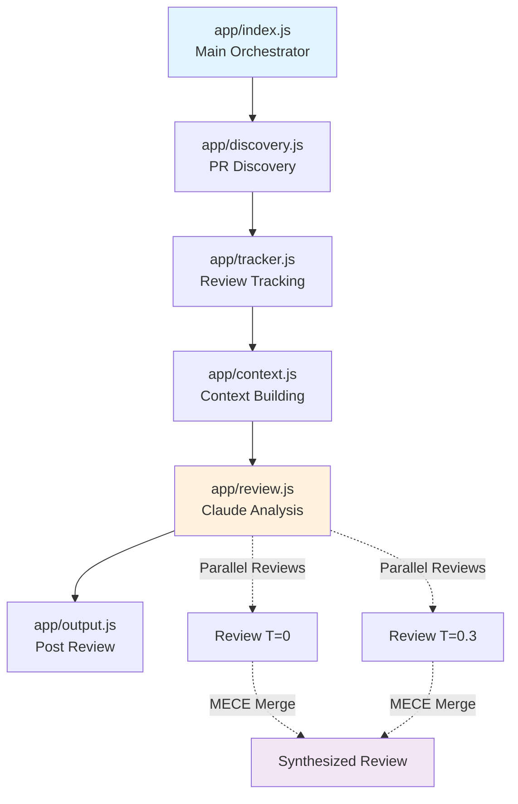
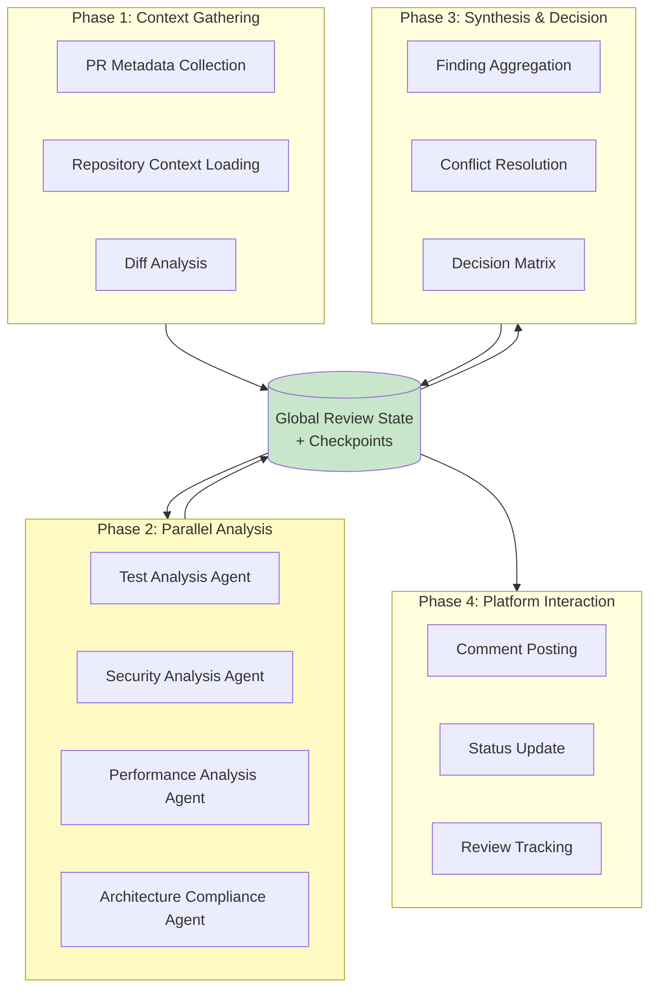
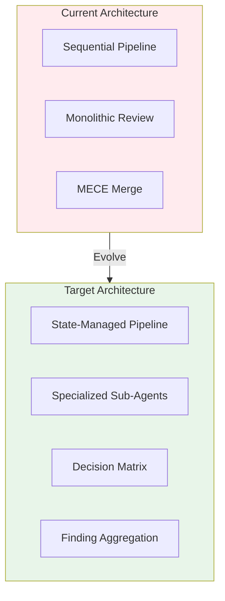
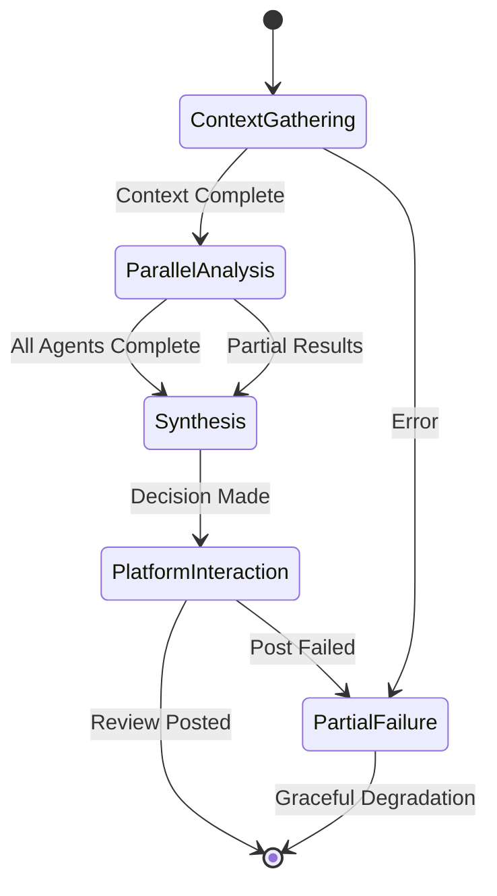
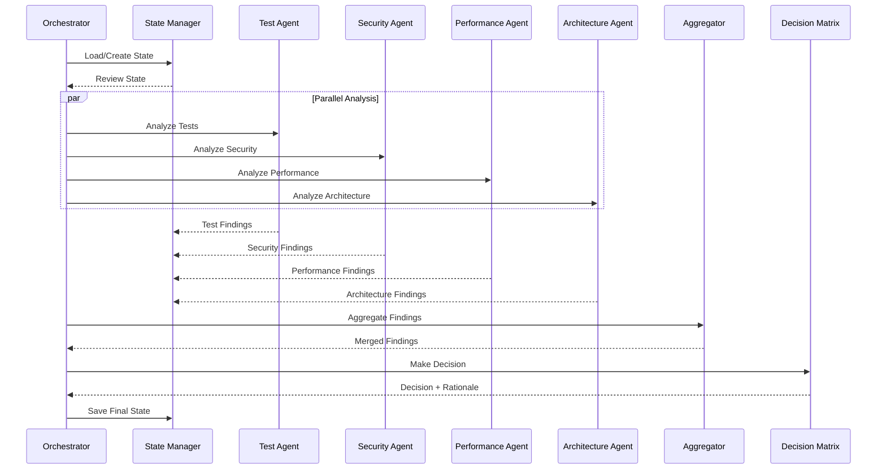

# Architecture Plan: Review Agent with Sub-Agent Architecture

**Document Version:** 1.0
**Date:** 2025-10-02
**Status:** Design Phase

---

## Executive Summary

This document outlines the architecture plan to evolve the current automated code review agent into a state-managed, sub-agent-based system following the architecture defined in `review-agent-architecure.md` and leveraging Claude Agent SDK subagent patterns.

### Key Objectives

1. **State Management**: Implement global review state with checkpointing and persistence
2. **Sub-Agent Architecture**: Decompose monolithic review logic into specialized analysis agents
3. **Decision Matrix**: Implement consistent, rule-based approval logic
4. **Parallel Analysis**: Leverage existing parallel review system for concurrent sub-agent execution
5. **Resilience**: Add error handling, partial failure support, and re-review detection

### Architecture Evolution

**Current State**: Sequential pipeline with single orchestrator
**Target State**: 4-phase architecture with state management and parallel sub-agents
**Migration Strategy**: Incremental, backward-compatible, 6-week implementation

---

## 1. Current State Analysis

### 1.1 Existing Architecture



**Current Modules:**
- `app/index.js` (270 lines) - Main orchestrator, sequential PR processing
- `app/discovery.js` - Multi-platform PR discovery (GitLab/GitHub/Bitbucket)
- `app/tracker.js` - SQLite-based review history tracking
- `app/context.js` - MCP-based context building (diffs, files, stats)
- `app/review.js` (600+ lines) - Claude-powered analysis with parallel reviews
- `app/output.js` - MCP-based comment/summary posting

### 1.2 Strengths to Preserve

✅ **Parallel Review System**: Existing dual-temperature review with MECE merge
✅ **MCP Integration**: Robust platform abstraction via Model Context Protocol
✅ **Error Handling**: Custom error types, retry logic with exponential backoff
✅ **Test Coverage**: 221/222 tests passing (99.5%), 94.4% coverage on review.js
✅ **Configuration System**: Environment variable substitution pattern

### 1.3 Architecture Gaps

| Gap | Current State | Target State | Impact |
|-----|--------------|--------------|--------|
| **State Management** | No global state, stateless modules | Global review state with persistence | High - Enables resilience, re-review |
| **Sub-Agent Architecture** | Monolithic review module | Specialized analysis agents | High - Scalability, maintainability |
| **Decision Matrix** | Implicit decision logic | Rule-based, configurable matrix | Medium - Consistency |
| **Finding Aggregation** | Single review output | Structured findings from multiple agents | Medium - Quality |
| **Partial Failure Handling** | All-or-nothing | Graceful degradation | Medium - Reliability |
| **Re-Review Detection** | Timestamp-based skip | Diff-based change detection | Low - Efficiency |

---

## 2. Target Architecture Design

### 2.1 Four-Phase Architecture



### 2.2 Global Review State Schema

```javascript
// app/state/ReviewState.js
class ReviewState {
  constructor(prId) {
    this.prId = prId;
    this.branch = null;
    this.baseBranch = null;
    this.platform = null;

    // Phase 1: Context
    this.context = {
      metadata: null,          // PR details, author, linked issues
      repository: null,        // Project structure, dependencies
      diff: null,             // Changed files, additions, deletions
      stats: null             // Metrics (filesChanged, lines, etc.)
    };

    // Phase 2: Analysis Results
    this.findings = {
      test: [],               // Test analysis findings
      security: [],           // Security analysis findings
      performance: [],        // Performance analysis findings
      architecture: []        // Architecture compliance findings
    };

    // Phase 3: Synthesis
    this.synthesis = {
      aggregated: [],         // Merged findings
      conflicts: [],          // Conflicting assessments
      decision: null,         // approve|request_changes|comment
      rationale: null         // Decision reasoning
    };

    // Phase 4: Output
    this.output = {
      comments: [],           // Posted comments with thread IDs
      summary: null,          // Review summary
      status: null            // completed|partial|failed
    };

    // Metadata
    this.phase = 'context_gathering';  // Current phase
    this.checkpoints = [];              // State snapshots
    this.errors = [];                   // Error log
    this.timestamp = Date.now();
  }
}
```

### 2.3 Sub-Agent Architecture Using Claude Agent SDK

Following Claude Agent SDK patterns, we'll implement sub-agents using **filesystem-based definitions** in `.claude/agents/`:

#### Test Analysis Agent

**Location**: `.claude/agents/test-analyzer.md`

```markdown
---
description: Specialized test coverage and quality analysis agent
model: sonnet
tools:
  - Read
  - Grep
  - Glob
---

You are a test analysis specialist with expertise in:
- Test coverage calculation and gap identification
- Test quality assessment (assertion strength, edge cases)
- Test naming conventions and organization
- Unit vs integration test balance

## Analysis Criteria

For each changed file:
1. **Coverage Delta**: Calculate test coverage change
2. **New Functionality Tests**: Verify tests exist for new features
3. **Test Quality**: Check assertion quality, mocking patterns
4. **Naming Conventions**: Validate test file naming

## Output Format

Return findings as structured JSON:
```json
{
  "findings": [
    {
      "file": "src/feature.js",
      "line": 42,
      "severity": "major",
      "category": "test_coverage",
      "message": "New function addUser() lacks test coverage",
      "suggestion": "Add test in tests/unit/feature.test.js"
    }
  ],
  "metrics": {
    "coverage_delta": -5.2,
    "new_tests": 3,
    "test_quality_score": 7.5
  }
}
```
```

#### Security Analysis Agent

**Location**: `.claude/agents/security-analyzer.md`

```markdown
---
description: Security vulnerability detection specialist
model: sonnet
tools:
  - Read
  - Grep
  - Glob
  - WebFetch
---

You are a security analysis specialist focused on:
- OWASP Top 10 vulnerability detection
- Input validation and sanitization
- Authentication and authorization checks
- Cryptographic usage patterns
- Dependency vulnerability scanning

## Security Checklist

- [ ] Input sanitization (SQL injection, XSS)
- [ ] Authentication checks before sensitive operations
- [ ] Secure cryptographic algorithms (no MD5/SHA1)
- [ ] Secrets/API keys not hardcoded
- [ ] Error messages don't leak sensitive info

## Output Format

```json
{
  "findings": [
    {
      "file": "api/auth.js",
      "line": 15,
      "severity": "critical",
      "category": "security",
      "cve": "CWE-89",
      "message": "SQL injection vulnerability in user query",
      "evidence": "const query = `SELECT * FROM users WHERE id = ${userId}`",
      "fix": "Use parameterized queries: db.query('SELECT * FROM users WHERE id = ?', [userId])"
    }
  ],
  "security_score": 6.5
}
```
```

#### Performance Analysis Agent

**Location**: `.claude/agents/performance-analyzer.md`

```markdown
---
description: Performance and efficiency analysis specialist
model: sonnet
tools:
  - Read
  - Grep
  - Glob
---

You are a performance analysis specialist evaluating:
- Algorithmic complexity (Big O notation)
- Database query patterns (N+1 queries)
- Memory allocation patterns
- Caching opportunities

## Analysis Process

1. **Complexity Analysis**: Calculate algorithmic complexity
2. **Query Patterns**: Detect N+1 queries, missing indexes
3. **Memory Profiling**: Identify memory leaks, large allocations
4. **Caching**: Find repeated computations

## Output Format

```json
{
  "findings": [
    {
      "file": "services/data.js",
      "line": 28,
      "severity": "major",
      "category": "performance",
      "message": "O(n²) nested loop detected",
      "complexity": "O(n²)",
      "suggestion": "Use Map for O(n) lookup: const userMap = new Map(users.map(u => [u.id, u]))"
    }
  ],
  "metrics": {
    "avg_complexity": "O(n log n)",
    "n_plus_one_queries": 2
  }
}
```
```

#### Architecture Compliance Agent

**Location**: `.claude/agents/architecture-analyzer.md`

```markdown
---
description: Architecture and design pattern compliance specialist
model: sonnet
tools:
  - Read
  - Grep
  - Glob
---

You are an architecture specialist analyzing:
- SOLID principles compliance
- Design pattern adherence
- Module boundaries and coupling
- Circular dependencies
- Layer violations

## Analysis Criteria

1. **Single Responsibility**: Each class/module has one reason to change
2. **Open/Closed**: Extensible without modification
3. **Dependency Inversion**: Depend on abstractions, not concretions
4. **Module Boundaries**: Clear separation of concerns

## Output Format

```json
{
  "findings": [
    {
      "file": "controllers/user.js",
      "line": 50,
      "severity": "major",
      "category": "architecture",
      "principle": "SRP",
      "message": "UserController violates SRP - handles auth, validation, and business logic",
      "suggestion": "Extract validation to UserValidator, business logic to UserService"
    }
  ],
  "violations": {
    "srp": 3,
    "dip": 1,
    "circular_deps": 2
  }
}
```
```

### 2.4 Sub-Agent Communication Pattern

```javascript
// app/agents/SubAgentOrchestrator.js
import { query } from '@anthropic-ai/sdk';

class SubAgentOrchestrator {
  /**
   * Execute sub-agents in parallel
   * @param {ReviewState} state - Global review state
   * @param {Object} config - Configuration
   */
  async executeParallelAnalysis(state, config) {
    // Define agent tasks
    const agentTasks = [
      {
        agent: 'test-analyzer',
        input: this.buildTestAnalysisPrompt(state)
      },
      {
        agent: 'security-analyzer',
        input: this.buildSecurityAnalysisPrompt(state)
      },
      {
        agent: 'performance-analyzer',
        input: this.buildPerformanceAnalysisPrompt(state)
      },
      {
        agent: 'architecture-analyzer',
        input: this.buildArchitectureAnalysisPrompt(state)
      }
    ];

    // Execute in parallel using Promise.all
    const results = await Promise.allSettled(
      agentTasks.map(task => this.invokeAgent(task.agent, task.input))
    );

    // Process results with error boundaries
    for (let i = 0; i < results.length; i++) {
      const result = results[i];
      const category = agentTasks[i].agent.replace('-analyzer', '');

      if (result.status === 'fulfilled') {
        state.findings[category] = this.parseFindings(result.value);
      } else {
        console.error(`${agentTasks[i].agent} failed:`, result.reason);
        state.errors.push({
          agent: agentTasks[i].agent,
          error: result.reason.message,
          phase: 'parallel_analysis'
        });
      }
    }

    return state;
  }

  /**
   * Invoke a specific sub-agent
   */
  async invokeAgent(agentName, prompt) {
    const response = await query({
      prompt,
      options: {
        agents: {
          [agentName]: {
            // Agent config loaded from .claude/agents/{agentName}.md
            inheritTools: false  // Use only tools defined in agent file
          }
        }
      }
    });

    return response.output;
  }
}
```

### 2.5 Decision Matrix Implementation

```javascript
// app/synthesis/DecisionMatrix.js
class DecisionMatrix {
  constructor(rules) {
    this.rules = rules || this.loadDefaultRules();
  }

  /**
   * Determine review decision based on aggregated findings
   * @param {Object} findings - Aggregated findings from all agents
   * @returns {Object} Decision with rationale
   */
  decide(findings) {
    // Count findings by severity
    const counts = this.countBySeverity(findings);

    // Apply decision rules
    if (counts.critical > 0) {
      return {
        decision: 'changes_requested',
        rationale: `Found ${counts.critical} critical issue(s) requiring immediate attention`,
        blocking_issues: this.getBlockingIssues(findings)
      };
    }

    if (counts.major >= this.rules.major_threshold) {
      return {
        decision: 'needs_work',
        rationale: `Found ${counts.major} major issue(s) exceeding threshold of ${this.rules.major_threshold}`,
        primary_concerns: this.getPrimaryConcerns(findings)
      };
    }

    if (counts.minor > 0) {
      return {
        decision: 'approved_with_comments',
        rationale: `Code is acceptable with ${counts.minor} minor suggestion(s)`,
        suggestions: this.getSuggestions(findings)
      };
    }

    return {
      decision: 'approved',
      rationale: 'No issues found - code meets quality standards'
    };
  }

  loadDefaultRules() {
    return {
      critical_threshold: 0,      // Any critical = changes_requested
      major_threshold: 3,          // 3+ major = needs_work
      minor_threshold: Infinity,   // Minor issues don't block
      coverage_delta_threshold: -5 // -5% coverage = needs_work
    };
  }
}
```

### 2.6 Integration with Existing MECE Merge

The target architecture **preserves** the existing parallel review system by integrating it with the sub-agent architecture:

```javascript
// app/review/ReviewOrchestrator.js
class ReviewOrchestrator {
  async reviewPR(state, config) {
    // Phase 1: Already completed (state has context)

    // Phase 2: Parallel Analysis (NEW)
    if (config.review.useSubAgents) {
      await this.subAgentOrchestrator.executeParallelAnalysis(state, config);
    } else {
      // Legacy: Use existing MECE merge
      const review = await this.legacyReview.runParallelReviews(state.context, config);
      state.findings.legacy = [review];
    }

    // Phase 3: Synthesis (ENHANCED)
    const synthesis = await this.synthesizer.synthesize(state, config);
    state.synthesis = synthesis;

    // Phase 4: Output (existing output.js)
    return state;
  }
}
```

---

## 3. Component Specifications

### 3.1 State Management Module

**File**: `app/state/StateManager.js`

**Responsibilities**:
- Manage global review state lifecycle
- Persist state to disk for resilience
- Provide state checkpointing
- Enable state recovery on failure

**Interface**:
```javascript
class StateManager {
  async createState(prId, platform, repository)
  async saveCheckpoint(state, phase)
  async loadState(prId)
  async updatePhase(state, newPhase)
  async appendFinding(state, category, finding)
}
```

### 3.2 Sub-Agent Base Class

**File**: `app/agents/BaseAgent.js`

**Responsibilities**:
- Define common agent interface
- Provide finding schema validation
- Handle error boundaries
- Standardize output format

**Interface**:
```javascript
class BaseAgent {
  constructor(name, description)
  async analyze(context, rules)
  validateFinding(finding)
  formatOutput(findings, metrics)
}
```

### 3.3 Finding Aggregator

**File**: `app/synthesis/FindingAggregator.js`

**Responsibilities**:
- Merge findings from all agents
- Detect and resolve conflicts
- Deduplicate similar findings
- Prioritize by severity

**Interface**:
```javascript
class FindingAggregator {
  async aggregate(findings)
  detectConflicts(findings)
  deduplicateFindings(findings)
  prioritizeFindings(findings)
}
```

---

## 4. Database Schema Changes

### 4.1 Enhanced Review Tracking

```sql
-- Add state persistence table
CREATE TABLE review_states (
  id INTEGER PRIMARY KEY,
  pr_id TEXT,
  platform TEXT,
  repository TEXT,
  phase TEXT,
  state_json TEXT,
  checkpoint_at DATETIME,
  FOREIGN KEY (pr_id) REFERENCES reviews(pr_id)
);

-- Add findings table for detailed tracking
CREATE TABLE review_findings (
  id INTEGER PRIMARY KEY,
  review_id INTEGER,
  agent TEXT,
  category TEXT,
  severity TEXT,
  file TEXT,
  line INTEGER,
  message TEXT,
  created_at DATETIME,
  FOREIGN KEY (review_id) REFERENCES reviews(id)
);

-- Index for efficient state recovery
CREATE INDEX idx_review_states_pr ON review_states(pr_id, checkpoint_at DESC);
```

---

## 5. Architecture Diagrams

### 5.1 Current vs Target Architecture



### 5.2 State Flow Diagram



### 5.3 Sub-Agent Communication Diagram



---

## 6. Consistency Mechanisms

### 6.1 Rule Configuration

**File**: `conf/review-rules.yml`

```yaml
# Decision thresholds
decision:
  critical_threshold: 0
  major_threshold: 3
  minor_threshold: 10

# Agent-specific rules
test_analysis:
  min_coverage: 80
  coverage_delta_threshold: -5
  required_patterns:
    - "*.test.js"
    - "*.spec.js"

security_analysis:
  scan_dependencies: true
  owasp_top_10: true
  require_sanitization: true

performance_analysis:
  max_complexity: 10
  detect_n_plus_one: true
  memory_threshold_mb: 100

architecture_analysis:
  enforce_solid: true
  max_coupling: 5
  detect_circular_deps: true
```

### 6.2 Validation Gates

Each phase implements validation gates:

```javascript
// app/validation/PhaseValidator.js
class PhaseValidator {
  validateContextPhase(state) {
    if (!state.context.metadata) throw new Error('Missing PR metadata');
    if (!state.context.diff) throw new Error('Missing diff data');
    if (state.context.stats.filesChanged === 0) throw new Error('No files changed');
  }

  validateAnalysisPhase(state) {
    const requiredAgents = ['test', 'security', 'performance', 'architecture'];
    for (const agent of requiredAgents) {
      if (!state.findings[agent]) {
        console.warn(`Missing findings from ${agent} agent`);
      }
    }
  }

  validateSynthesisPhase(state) {
    if (!state.synthesis.decision) throw new Error('No decision made');
    if (!state.synthesis.rationale) throw new Error('Missing decision rationale');
  }
}
```

---

## 7. Error Handling Strategy

### 7.1 Partial Failure Handling

```javascript
// app/error/PartialFailureHandler.js
class PartialFailureHandler {
  async handle(state, phase, error) {
    // Log error
    state.errors.push({
      phase,
      error: error.message,
      timestamp: Date.now()
    });

    // Determine if we can continue
    if (this.isCriticalFailure(phase, error)) {
      state.output.status = 'failed';
      return this.postFailureNotice(state);
    }

    // Continue with partial results
    state.output.status = 'partial';
    console.warn(`Phase ${phase} partially failed, continuing with available data`);

    return state;
  }

  isCriticalFailure(phase, error) {
    // Context phase failures are critical
    if (phase === 'context_gathering') return true;

    // Platform interaction failures prevent completion
    if (phase === 'platform_interaction') return true;

    // Analysis failures are non-critical (can use partial findings)
    return false;
  }
}
```

### 7.2 Re-Review Detection

```javascript
// app/tracking/ReReviewDetector.js
class ReReviewDetector {
  async shouldReReview(pr, previousState) {
    // Check if PR was updated since last review
    if (pr.updated_at > previousState.timestamp) {
      // Load previous findings
      const previousFindings = previousState.findings;

      // Get current diff
      const currentDiff = await this.getDiff(pr);

      // Diff the diffs to find what changed
      const changeDelta = this.diffDiffs(previousState.context.diff, currentDiff);

      if (changeDelta.newFiles.length > 0 || changeDelta.modifiedLines.length > 0) {
        return {
          shouldReview: true,
          scope: 'delta',  // Only review changed portions
          delta: changeDelta
        };
      }
    }

    return { shouldReview: false };
  }
}
```

---

## 8. Performance Considerations

### 8.1 Parallel Execution

- **Sub-agents run concurrently** using `Promise.allSettled()`
- **Expected speedup**: 3-4x (4 agents in parallel vs sequential)
- **Resource usage**: Monitor Claude API rate limits

### 8.2 State Persistence

- **Checkpoint frequency**: After each phase completion
- **Storage overhead**: ~10KB per review state (JSON)
- **Cleanup strategy**: Delete states older than 30 days

### 8.3 Caching Strategy

```javascript
// app/cache/AnalysisCache.js
class AnalysisCache {
  async getCachedAnalysis(fileHash, agentType) {
    // Cache analysis results by file content hash
    const key = `${agentType}:${fileHash}`;
    return await this.cache.get(key);
  }

  async setCachedAnalysis(fileHash, agentType, findings, ttl = 86400) {
    const key = `${agentType}:${fileHash}`;
    await this.cache.set(key, findings, ttl);
  }
}
```

---

## 9. Rollout Strategy

### 9.1 Feature Flag Configuration

```json
{
  "features": {
    "use_sub_agents": false,           // Enable sub-agent architecture
    "use_state_management": false,      // Enable state persistence
    "use_decision_matrix": false,       // Enable rule-based decisions
    "legacy_mode": true                 // Fall back to existing system
  }
}
```

### 9.2 Gradual Rollout Plan

1. **Week 1-2**: Deploy state management with legacy mode
2. **Week 3-4**: Enable sub-agents for 10% of reviews (A/B test)
3. **Week 5**: Enable decision matrix for 50% of reviews
4. **Week 6**: Full rollout to 100% of reviews
5. **Week 7**: Deprecate legacy mode

---

## 10. Success Metrics

### 10.1 Quality Metrics

- **Finding Accuracy**: % of findings that are valid (target: >90%)
- **False Positive Rate**: % of findings that are false positives (target: <10%)
- **Decision Consistency**: % of decisions that match manual review (target: >85%)

### 10.2 Performance Metrics

- **Review Latency**: Time from PR discovery to review posted (target: <3 min)
- **Agent Execution Time**: Parallel analysis duration (target: <1 min)
- **State Persistence Overhead**: Time to checkpoint state (target: <100ms)

### 10.3 Reliability Metrics

- **Partial Failure Rate**: % of reviews that complete with partial failures (target: <5%)
- **State Recovery Success**: % of resumed reviews that complete successfully (target: >95%)
- **Error Rate**: % of reviews that fail completely (target: <2%)

---

## 11. Security Considerations

### 11.1 Sub-Agent Isolation

- **Tool Restriction**: Limit agents to read-only tools for security analysis
- **Sandboxing**: Run agents in isolated contexts
- **Credential Access**: Only orchestrator accesses platform credentials

### 11.2 State Security

- **Encryption**: Encrypt state files containing sensitive code snippets
- **Access Control**: Restrict state file access to review agent process
- **PII Handling**: Redact personal information from state persistence

---

## Appendix A: Terminology

- **MECE**: Mutually Exclusive, Collectively Exhaustive (deduplication principle)
- **MCP**: Model Context Protocol (platform abstraction layer)
- **Sub-Agent**: Specialized AI agent with focused responsibility
- **Finding**: Single issue identified by an agent
- **Synthesis**: Process of aggregating and resolving findings
- **Decision Matrix**: Rule-based system for approval decisions
- **State Checkpoint**: Snapshot of review state for recovery

## Appendix B: References

- Claude Agent SDK Subagent Documentation: https://docs.claude.com/en/api/agent-sdk/subagents
- Target Architecture: `review-agent-architecure.md`
- Current Implementation: `app/` directory
- Test Suite: `tests/` directory
