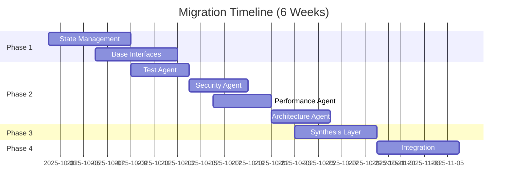

# Migration Guide: Sub-Agent Architecture Implementation

**Document Version:** 1.0
**Date:** 2025-10-02
**Timeline:** 6 weeks
**Status:** Implementation Ready

---

## Overview

This guide provides step-by-step instructions to migrate from the current sequential pipeline architecture to a state-managed, sub-agent-based system. The migration is designed to be **incremental**, **backward-compatible**, and **testable** at each phase.

### Migration Principles

1. **Incremental Delivery**: Each phase is independently deployable
2. **Backward Compatibility**: Legacy mode available during transition
3. **Test-Driven**: Comprehensive tests required at each phase
4. **Rollback Ready**: Clear rollback procedures for each phase
5. **Zero Downtime**: Feature flags enable gradual rollout

### Timeline Overview



---

## Phase 1: Foundation (Weeks 1-2)

### Objectives
- Implement state management module
- Create base sub-agent interface
- Add feature flags for gradual rollout
- Refactor orchestrator to use state

### 1.1 Create State Management Module

**File**: `app/state/ReviewState.js`

```javascript
/**
 * Global review state with checkpointing
 */
export class ReviewState {
  constructor(prId, platform, repository) {
    this.prId = prId;
    this.platform = platform;
    this.repository = repository;
    this.branch = null;
    this.baseBranch = null;

    // Phase 1: Context
    this.context = {
      metadata: null,
      repository: null,
      diff: null,
      stats: null
    };

    // Phase 2: Analysis
    this.findings = {
      test: [],
      security: [],
      performance: [],
      architecture: []
    };

    // Phase 3: Synthesis
    this.synthesis = {
      aggregated: [],
      conflicts: [],
      decision: null,
      rationale: null
    };

    // Phase 4: Output
    this.output = {
      comments: [],
      summary: null,
      status: null
    };

    // Metadata
    this.phase = 'context_gathering';
    this.checkpoints = [];
    this.errors = [];
    this.timestamp = Date.now();
  }

  /**
   * Transition to next phase
   */
  transitionTo(newPhase) {
    this.checkpoints.push({
      phase: this.phase,
      timestamp: Date.now()
    });
    this.phase = newPhase;
  }

  /**
   * Add error with context
   */
  addError(phase, error) {
    this.errors.push({
      phase,
      error: error.message,
      stack: error.stack,
      timestamp: Date.now()
    });
  }
}
```

**File**: `app/state/StateManager.js`

```javascript
import { ReviewState } from './ReviewState.js';
import fs from 'fs/promises';
import path from 'path';

export class StateManager {
  constructor(stateDir = './data/states') {
    this.stateDir = stateDir;
  }

  async initialize() {
    await fs.mkdir(this.stateDir, { recursive: true });
  }

  /**
   * Create new review state
   */
  async createState(prId, platform, repository) {
    const state = new ReviewState(prId, platform, repository);
    await this.saveState(state);
    return state;
  }

  /**
   * Load existing state
   */
  async loadState(prId) {
    const filePath = path.join(this.stateDir, `${prId}.json`);
    try {
      const data = await fs.readFile(filePath, 'utf-8');
      const json = JSON.parse(data);

      // Recreate ReviewState instance
      const state = Object.assign(new ReviewState(), json);
      return state;
    } catch (error) {
      if (error.code === 'ENOENT') {
        return null; // State not found
      }
      throw error;
    }
  }

  /**
   * Save state checkpoint
   */
  async saveState(state) {
    const filePath = path.join(this.stateDir, `${state.prId}.json`);
    await fs.writeFile(filePath, JSON.stringify(state, null, 2));
  }

  /**
   * Delete old states (cleanup)
   */
  async cleanupOldStates(daysOld = 30) {
    const files = await fs.readdir(this.stateDir);
    const cutoff = Date.now() - (daysOld * 24 * 60 * 60 * 1000);

    let deleted = 0;
    for (const file of files) {
      const filePath = path.join(this.stateDir, file);
      const stats = await fs.stat(filePath);

      if (stats.mtime.getTime() < cutoff) {
        await fs.unlink(filePath);
        deleted++;
      }
    }

    return deleted;
  }
}
```

**Tests**: `tests/unit/state-manager.test.js`

```javascript
import { StateManager } from '../../app/state/StateManager.js';
import { ReviewState } from '../../app/state/ReviewState.js';
import fs from 'fs/promises';

describe('StateManager', () => {
  let stateManager;
  const testStateDir = './data/test-states';

  beforeEach(async () => {
    stateManager = new StateManager(testStateDir);
    await stateManager.initialize();
  });

  afterEach(async () => {
    // Cleanup test states
    await fs.rm(testStateDir, { recursive: true, force: true });
  });

  it('should create and save new state', async () => {
    const state = await stateManager.createState('PR-123', 'gitlab', 'org/repo');

    expect(state.prId).toBe('PR-123');
    expect(state.platform).toBe('gitlab');
    expect(state.phase).toBe('context_gathering');
  });

  it('should load existing state', async () => {
    const originalState = await stateManager.createState('PR-456', 'gitlab', 'org/repo');
    originalState.phase = 'parallel_analysis';
    await stateManager.saveState(originalState);

    const loadedState = await stateManager.loadState('PR-456');
    expect(loadedState.phase).toBe('parallel_analysis');
  });

  it('should handle state transitions', async () => {
    const state = new ReviewState('PR-789', 'gitlab', 'org/repo');

    state.transitionTo('parallel_analysis');
    expect(state.phase).toBe('parallel_analysis');
    expect(state.checkpoints).toHaveLength(1);
    expect(state.checkpoints[0].phase).toBe('context_gathering');
  });
});
```

### 1.2 Add Feature Flags

**File**: `conf/config.json` (add features section)

```json
{
  "features": {
    "useStateManagement": false,
    "useSubAgents": false,
    "useDecisionMatrix": false,
    "legacyMode": true
  },
  "review": {
    "maxDaysBack": 30,
    "prStates": ["open"],
    "parallelReviews": {
      "enabled": true,
      "temperatures": [0, 0.3]
    }
  }
  // ... rest of config
}
```

**File**: `app/utils/featureFlags.js`

```javascript
export class FeatureFlags {
  constructor(config) {
    this.flags = config.features || {};
  }

  isEnabled(flagName) {
    return this.flags[flagName] === true;
  }

  require(flagName) {
    if (!this.isEnabled(flagName)) {
      throw new Error(`Feature '${flagName}' is not enabled`);
    }
  }
}
```

### 1.3 Refactor Main Orchestrator

**File**: `app/index.js` (modified)

```javascript
import { StateManager } from './state/StateManager.js';
import { FeatureFlags } from './utils/featureFlags.js';
// ... existing imports

class CodeReviewAgent {
  async run() {
    console.log('🤖 Code Review Agent Starting...\n');

    const config = await loadConfig();
    validateConfig(config);

    const featureFlags = new FeatureFlags(config);
    const stateManager = new StateManager();
    await stateManager.initialize();

    // ... existing code

    for (const pr of prs) {
      try {
        // Check if using state management
        let state;
        if (featureFlags.isEnabled('useStateManagement')) {
          // New: State-managed flow
          state = await stateManager.createState(pr.id, pr.platform, pr.project_id);
          await this.runStateManagedReview(state, config, featureFlags);
        } else {
          // Legacy: Existing flow
          await this.runLegacyReview(pr, config);
        }

      } catch (error) {
        console.error(`❌ Error: ${error.message}`);
        errors++;
      }
    }
  }

  /**
   * Legacy review flow (existing)
   */
  async runLegacyReview(pr, config) {
    // Existing implementation unchanged
    const prContext = await context.buildContext(pr, config);
    const reviewResult = await review.reviewPR(prContext, config);
    const postResult = await output.postReview(pr, reviewResult, config);
    await tracker.markReviewed({ /* ... */ });
  }

  /**
   * State-managed review flow (new)
   */
  async runStateManagedReview(state, config, featureFlags) {
    const stateManager = new StateManager();

    // Phase 1: Context Gathering
    console.log('📦 Phase 1: Context Gathering...');
    await this.gatherContext(state, config);
    await stateManager.saveState(state);

    // Phase 2: Analysis (legacy or sub-agents)
    console.log('🔍 Phase 2: Analysis...');
    if (featureFlags.isEnabled('useSubAgents')) {
      // Future: Sub-agent analysis
      console.log('  Using sub-agents (not implemented yet)');
    } else {
      // Use existing review system
      const reviewResult = await review.reviewPR(state.context, config);
      state.findings.legacy = [reviewResult];
    }
    await stateManager.saveState(state);

    // Phase 3: Synthesis
    console.log('🎯 Phase 3: Synthesis...');
    // For now, use findings directly
    state.synthesis.decision = state.findings.legacy[0].decision;
    await stateManager.saveState(state);

    // Phase 4: Output
    console.log('📮 Phase 4: Output...');
    const pr = this.reconstructPR(state);
    await output.postReview(pr, state.findings.legacy[0], config);
  }

  async gatherContext(state, config) {
    const pr = this.reconstructPR(state);
    const prContext = await context.buildContext(pr, config);

    state.context.metadata = prContext.pr;
    state.context.diff = prContext.diff;
    state.context.stats = prContext.stats;
    state.transitionTo('parallel_analysis');
  }

  reconstructPR(state) {
    return {
      id: state.prId,
      platform: state.platform,
      project_id: state.repository
    };
  }
}
```

### 1.4 Validation & Testing

**Run Tests**:
```bash
npm test tests/unit/state-manager.test.js
```

**Integration Test**:
```bash
# Enable state management
export USE_STATE_MANAGEMENT=true

# Run in dry-run mode
npm run dry-run

# Verify states created in data/states/
ls -la data/states/
```

### 1.5 Rollback Procedure (Phase 1)

If issues arise:

1. **Disable feature flag**:
   ```json
   { "features": { "useStateManagement": false } }
   ```

2. **Revert code changes**:
   ```bash
   git revert <commit-hash>
   git push origin main
   ```

3. **Clean up state files**:
   ```bash
   rm -rf data/states/
   ```

---

## Phase 2: Sub-Agent Extraction (Weeks 3-4)

### Objectives
- Create sub-agent base class
- Implement 4 specialized agents using Claude Agent SDK
- Integrate with state management

### 2.1 Create Sub-Agent Base Class

**File**: `app/agents/BaseAgent.js`

```javascript
export class BaseAgent {
  constructor(name, description) {
    this.name = name;
    this.description = description;
  }

  /**
   * Analyze code and return findings
   * @param {Object} context - Review context
   * @param {Object} rules - Agent-specific rules
   * @returns {Promise<Object>} Findings with metrics
   */
  async analyze(context, rules) {
    throw new Error('analyze() must be implemented by subclass');
  }

  /**
   * Validate finding structure
   */
  validateFinding(finding) {
    const required = ['file', 'severity', 'category', 'message'];
    for (const field of required) {
      if (!finding[field]) {
        throw new Error(`Finding missing required field: ${field}`);
      }
    }

    if (!['critical', 'major', 'minor'].includes(finding.severity)) {
      throw new Error(`Invalid severity: ${finding.severity}`);
    }

    return true;
  }

  /**
   * Format output as structured JSON
   */
  formatOutput(findings, metrics = {}) {
    // Validate all findings
    findings.forEach(f => this.validateFinding(f));

    return {
      agent: this.name,
      findings,
      metrics,
      timestamp: Date.now()
    };
  }
}
```

### 2.2 Create Sub-Agent Definitions

Create `.claude/agents/` directory:

```bash
mkdir -p .claude/agents
```

**File**: `.claude/agents/test-analyzer.md`

```markdown
---
description: Specialized test coverage and quality analysis agent
model: sonnet
tools:
  - Read
  - Grep
  - Glob
---

You are a test analysis specialist. Analyze the provided code changes for test coverage and quality.

## Analysis Process

For each changed file:
1. Check if corresponding test file exists
2. Calculate coverage delta
3. Assess test quality (assertions, edge cases)
4. Verify naming conventions

## Output Format

Return findings as JSON:
```json
{
  "findings": [
    {
      "file": "src/feature.js",
      "line": 42,
      "severity": "major|minor|critical",
      "category": "test_coverage",
      "message": "Description of issue",
      "suggestion": "How to fix"
    }
  ],
  "metrics": {
    "coverage_delta": -5.2,
    "new_tests": 3,
    "test_quality_score": 7.5
  }
}
```
```

**File**: `.claude/agents/security-analyzer.md`

```markdown
---
description: Security vulnerability detection specialist (OWASP Top 10)
model: sonnet
tools:
  - Read
  - Grep
  - Glob
---

You are a security specialist. Analyze code for OWASP Top 10 vulnerabilities.

## Security Checklist

- [ ] SQL injection (parameterized queries?)
- [ ] XSS (input sanitization?)
- [ ] Authentication (checks before sensitive ops?)
- [ ] Crypto (no MD5/SHA1?)
- [ ] Secrets (no hardcoded API keys?)

## Output Format

```json
{
  "findings": [
    {
      "file": "api/auth.js",
      "line": 15,
      "severity": "critical",
      "category": "security",
      "cve": "CWE-89",
      "message": "SQL injection vulnerability",
      "evidence": "Line of code",
      "fix": "Recommended fix"
    }
  ],
  "metrics": {
    "security_score": 8.5,
    "vulnerabilities_found": 1
  }
}
```
```

**File**: `.claude/agents/performance-analyzer.md`

```markdown
---
description: Performance and algorithmic complexity analysis
model: sonnet
tools:
  - Read
  - Grep
---

Analyze code for performance issues and algorithmic complexity.

## Analysis Criteria

1. Algorithmic complexity (Big O)
2. Database query patterns (N+1 queries)
3. Memory allocation
4. Caching opportunities

## Output Format

```json
{
  "findings": [
    {
      "file": "services/data.js",
      "line": 28,
      "severity": "major",
      "category": "performance",
      "message": "O(n²) nested loop detected",
      "complexity": "O(n²)",
      "suggestion": "Use Map for O(n) lookup"
    }
  ],
  "metrics": {
    "avg_complexity": "O(n log n)",
    "n_plus_one_queries": 2
  }
}
```
```

**File**: `.claude/agents/architecture-analyzer.md`

```markdown
---
description: Architecture and SOLID principles compliance
model: sonnet
tools:
  - Read
  - Grep
  - Glob
---

Analyze code architecture and design patterns.

## Analysis Focus

- SOLID principles (SRP, OCP, LSP, ISP, DIP)
- Design patterns
- Module boundaries
- Circular dependencies

## Output Format

```json
{
  "findings": [
    {
      "file": "controllers/user.js",
      "line": 50,
      "severity": "major",
      "category": "architecture",
      "principle": "SRP",
      "message": "Violates Single Responsibility Principle",
      "suggestion": "Extract validation to separate class"
    }
  ],
  "metrics": {
    "solid_violations": {
      "srp": 3,
      "dip": 1
    }
  }
}
```
```

### 2.3 Create Sub-Agent Orchestrator

**File**: `app/agents/SubAgentOrchestrator.js`

```javascript
import { Task } from '@anthropic-ai/sdk';  // Claude Agent SDK

export class SubAgentOrchestrator {
  /**
   * Execute all sub-agents in parallel
   */
  async executeParallelAnalysis(state, config) {
    console.log('  Executing sub-agents in parallel...');

    const agentTasks = [
      { agent: 'test-analyzer', category: 'test' },
      { agent: 'security-analyzer', category: 'security' },
      { agent: 'performance-analyzer', category: 'performance' },
      { agent: 'architecture-analyzer', category: 'architecture' }
    ];

    // Build prompts for each agent
    const prompts = agentTasks.map(task => ({
      agent: task.agent,
      category: task.category,
      prompt: this.buildAgentPrompt(state, task.agent)
    }));

    // Execute in parallel
    const results = await Promise.allSettled(
      prompts.map(p => this.invokeAgent(p.agent, p.prompt))
    );

    // Process results
    for (let i = 0; i < results.length; i++) {
      const result = results[i];
      const task = agentTasks[i];

      if (result.status === 'fulfilled') {
        const findings = this.parseFindings(result.value);
        state.findings[task.category] = findings.findings || [];

        console.log(`    ✓ ${task.agent}: ${findings.findings?.length || 0} findings`);
      } else {
        console.error(`    ✗ ${task.agent} failed: ${result.reason.message}`);
        state.addError('parallel_analysis', result.reason);
      }
    }

    state.transitionTo('synthesis');
    return state;
  }

  /**
   * Invoke a specific sub-agent using Claude Agent SDK
   */
  async invokeAgent(agentName, prompt) {
    // Use Claude Agent SDK Task API
    const response = await Task({
      subagent_type: agentName,
      description: `Run ${agentName}`,
      prompt
    });

    return response;
  }

  /**
   * Build prompt for specific agent
   */
  buildAgentPrompt(state, agentName) {
    const context = state.context;

    let prompt = `Analyze the following code changes:\n\n`;

    // Include diff
    prompt += `## Changed Files\n\n`;
    for (const file of context.diff || []) {
      prompt += `### ${file.new_path}\n`;
      prompt += `\`\`\`diff\n${file.diff}\n\`\`\`\n\n`;
    }

    // Include stats
    prompt += `## Statistics\n`;
    prompt += `- Files changed: ${context.stats?.filesChanged || 0}\n`;
    prompt += `- Additions: +${context.stats?.additions || 0}\n`;
    prompt += `- Deletions: -${context.stats?.deletions || 0}\n\n`;

    prompt += `Provide findings in the specified JSON format.`;

    return prompt;
  }

  /**
   * Parse findings from agent response
   */
  parseFindings(response) {
    try {
      // Agent should return JSON
      const parsed = typeof response === 'string' ? JSON.parse(response) : response;
      return parsed;
    } catch (error) {
      console.error('Failed to parse agent response:', error);
      return { findings: [], metrics: {} };
    }
  }
}
```

### 2.4 Integrate Sub-Agents with Orchestrator

**File**: `app/index.js` (update runStateManagedReview method)

```javascript
import { SubAgentOrchestrator } from './agents/SubAgentOrchestrator.js';

class CodeReviewAgent {
  async runStateManagedReview(state, config, featureFlags) {
    const stateManager = new StateManager();
    const subAgentOrch = new SubAgentOrchestrator();

    // Phase 1: Context Gathering
    await this.gatherContext(state, config);
    await stateManager.saveState(state);

    // Phase 2: Analysis
    console.log('🔍 Phase 2: Analysis...');
    if (featureFlags.isEnabled('useSubAgents')) {
      // Use sub-agents
      await subAgentOrch.executeParallelAnalysis(state, config);
    } else {
      // Legacy review
      const reviewResult = await review.reviewPR(state.context, config);
      state.findings.legacy = [reviewResult];
    }
    await stateManager.saveState(state);

    // Phase 3 & 4 continue...
  }
}
```

### 2.5 Testing Sub-Agents

**File**: `tests/unit/sub-agent-orchestrator.test.js`

```javascript
import { SubAgentOrchestrator } from '../../app/agents/SubAgentOrchestrator.js';
import { ReviewState } from '../../app/state/ReviewState.js';

jest.mock('@anthropic-ai/sdk', () => ({
  Task: jest.fn()
}));

import { Task } from '@anthropic-ai/sdk';

describe('SubAgentOrchestrator', () => {
  let orchestrator;
  let mockState;

  beforeEach(() => {
    orchestrator = new SubAgentOrchestrator();
    mockState = new ReviewState('PR-123', 'gitlab', 'org/repo');
    mockState.context.diff = [
      { new_path: 'src/app.js', diff: '@@ -1,3 +1,3 @@\n-old\n+new' }
    ];
    mockState.context.stats = { filesChanged: 1, additions: 1, deletions: 1 };
  });

  it('should execute all agents in parallel', async () => {
    // Mock agent responses
    Task.mockResolvedValue(JSON.stringify({
      findings: [{ file: 'src/app.js', severity: 'minor', category: 'test', message: 'Missing test' }],
      metrics: { coverage_delta: -2 }
    }));

    await orchestrator.executeParallelAnalysis(mockState, {});

    expect(Task).toHaveBeenCalledTimes(4);
    expect(mockState.findings.test).toHaveLength(1);
  });

  it('should handle agent failures gracefully', async () => {
    Task
      .mockResolvedValueOnce(JSON.stringify({ findings: [], metrics: {} }))
      .mockRejectedValueOnce(new Error('Agent failed'))
      .mockResolvedValueOnce(JSON.stringify({ findings: [], metrics: {} }))
      .mockResolvedValueOnce(JSON.stringify({ findings: [], metrics: {} }));

    await orchestrator.executeParallelAnalysis(mockState, {});

    expect(mockState.errors).toHaveLength(1);
    expect(mockState.errors[0].phase).toBe('parallel_analysis');
  });
});
```

### 2.6 Rollback Procedure (Phase 2)

```bash
# 1. Disable sub-agents feature flag
# In conf/config.json: "useSubAgents": false

# 2. Remove agent files (optional)
rm -rf .claude/agents/

# 3. Revert code
git revert <commit-hash-range>
```

---

## Phase 3: Synthesis Layer (Week 5)

### Objectives
- Implement finding aggregation
- Build decision matrix
- Add conflict resolution
- Integrate with MECE merge

### 3.1 Create Finding Aggregator

**File**: `app/synthesis/FindingAggregator.js`

```javascript
export class FindingAggregator {
  /**
   * Aggregate findings from all agents
   */
  async aggregate(state) {
    const allFindings = [];

    // Collect from all agent categories
    for (const category of ['test', 'security', 'performance', 'architecture']) {
      const categoryFindings = state.findings[category] || [];
      categoryFindings.forEach(f => {
        f.source_agent = category;
        allFindings.push(f);
      });
    }

    // Deduplicate similar findings
    const deduplicated = this.deduplicateFindings(allFindings);

    // Detect conflicts
    const conflicts = this.detectConflicts(deduplicated);

    // Prioritize by severity
    const prioritized = this.prioritizeFindings(deduplicated);

    return {
      aggregated: prioritized,
      conflicts,
      total: prioritized.length
    };
  }

  /**
   * Deduplicate similar findings (MECE principle)
   */
  deduplicateFindings(findings) {
    const unique = [];
    const seen = new Set();

    for (const finding of findings) {
      // Create fingerprint: file + line + category
      const fingerprint = `${finding.file}:${finding.line}:${finding.category}`;

      if (!seen.has(fingerprint)) {
        seen.add(fingerprint);
        unique.push(finding);
      } else {
        // Finding exists, maybe merge severity
        const existing = unique.find(f =>
          f.file === finding.file &&
          f.line === finding.line &&
          f.category === finding.category
        );

        if (existing && this.isSeverityHigher(finding.severity, existing.severity)) {
          existing.severity = finding.severity;
          existing.sources = [...(existing.sources || [existing.source_agent]), finding.source_agent];
        }
      }
    }

    return unique;
  }

  /**
   * Detect conflicting assessments
   */
  detectConflicts(findings) {
    const conflicts = [];
    const grouped = this.groupByLocation(findings);

    for (const [location, items] of Object.entries(grouped)) {
      if (items.length > 1) {
        const severities = new Set(items.map(f => f.severity));
        if (severities.size > 1) {
          conflicts.push({
            location,
            items,
            reason: 'Different severity levels from multiple agents'
          });
        }
      }
    }

    return conflicts;
  }

  /**
   * Prioritize findings by severity
   */
  prioritizeFindings(findings) {
    const severityOrder = { critical: 0, major: 1, minor: 2 };

    return findings.sort((a, b) => {
      return severityOrder[a.severity] - severityOrder[b.severity];
    });
  }

  groupByLocation(findings) {
    const groups = {};
    for (const finding of findings) {
      const key = `${finding.file}:${finding.line}`;
      if (!groups[key]) groups[key] = [];
      groups[key].push(finding);
    }
    return groups;
  }

  isSeverityHigher(sev1, sev2) {
    const order = { critical: 3, major: 2, minor: 1 };
    return order[sev1] > order[sev2];
  }
}
```

### 3.2 Create Decision Matrix

**File**: `app/synthesis/DecisionMatrix.js`

```javascript
export class DecisionMatrix {
  constructor(rules) {
    this.rules = rules || this.getDefaultRules();
  }

  /**
   * Make review decision based on findings
   */
  decide(findings, metrics = {}) {
    const counts = this.countBySeverity(findings);

    // Rule 1: Any critical = changes_requested
    if (counts.critical > 0) {
      return {
        decision: 'changes_requested',
        rationale: `Found ${counts.critical} critical issue(s) that must be addressed`,
        blocking_issues: findings.filter(f => f.severity === 'critical')
      };
    }

    // Rule 2: Too many major = needs_work
    if (counts.major >= this.rules.major_threshold) {
      return {
        decision: 'needs_work',
        rationale: `Found ${counts.major} major issues exceeding threshold (${this.rules.major_threshold})`,
        primary_concerns: findings.filter(f => f.severity === 'major')
      };
    }

    // Rule 3: Coverage delta check
    if (metrics.coverage_delta && metrics.coverage_delta < this.rules.coverage_delta_threshold) {
      return {
        decision: 'needs_work',
        rationale: `Test coverage decreased by ${Math.abs(metrics.coverage_delta)}% (threshold: ${Math.abs(this.rules.coverage_delta_threshold)}%)`,
        coverage_issue: true
      };
    }

    // Rule 4: Only minor issues = approved with comments
    if (counts.minor > 0) {
      return {
        decision: 'approved_with_comments',
        rationale: `Code is acceptable with ${counts.minor} minor suggestion(s)`,
        suggestions: findings.filter(f => f.severity === 'minor')
      };
    }

    // Rule 5: No issues = approved
    return {
      decision: 'approved',
      rationale: 'No issues found - code meets quality standards'
    };
  }

  countBySeverity(findings) {
    return findings.reduce((acc, f) => {
      acc[f.severity] = (acc[f.severity] || 0) + 1;
      return acc;
    }, { critical: 0, major: 0, minor: 0 });
  }

  getDefaultRules() {
    return {
      critical_threshold: 0,
      major_threshold: 3,
      minor_threshold: 10,
      coverage_delta_threshold: -5
    };
  }
}
```

### 3.3 Integrate Synthesis Layer

**File**: `app/index.js` (update synthesis phase)

```javascript
import { FindingAggregator } from './synthesis/FindingAggregator.js';
import { DecisionMatrix } from './synthesis/DecisionMatrix.js';

class CodeReviewAgent {
  async runStateManagedReview(state, config, featureFlags) {
    // ... Phase 1 & 2

    // Phase 3: Synthesis
    console.log('🎯 Phase 3: Synthesis...');
    const aggregator = new FindingAggregator();
    const decisionMatrix = new DecisionMatrix(config.review.rules);

    const { aggregated, conflicts } = await aggregator.aggregate(state);
    state.synthesis.aggregated = aggregated;
    state.synthesis.conflicts = conflicts;

    // Collect metrics from findings
    const metrics = this.collectMetrics(state);

    // Make decision
    const decision = decisionMatrix.decide(aggregated, metrics);
    state.synthesis.decision = decision.decision;
    state.synthesis.rationale = decision.rationale;

    console.log(`  Decision: ${decision.decision}`);
    console.log(`  Findings: ${aggregated.length} (${conflicts.length} conflicts resolved)`);

    await stateManager.saveState(state);

    // Phase 4: Output...
  }

  collectMetrics(state) {
    const metrics = {};

    // Collect from all agents
    for (const category of ['test', 'security', 'performance', 'architecture']) {
      const findings = state.findings[category] || [];
      if (findings.metrics) {
        Object.assign(metrics, findings.metrics);
      }
    }

    return metrics;
  }
}
```

### 3.4 Testing Synthesis Layer

**File**: `tests/unit/synthesis.test.js`

```javascript
import { FindingAggregator } from '../../app/synthesis/FindingAggregator.js';
import { DecisionMatrix } from '../../app/synthesis/DecisionMatrix.js';

describe('Synthesis Layer', () => {
  describe('FindingAggregator', () => {
    it('should deduplicate identical findings', () => {
      const aggregator = new FindingAggregator();
      const findings = [
        { file: 'a.js', line: 10, severity: 'major', category: 'test', message: 'Issue', source_agent: 'test' },
        { file: 'a.js', line: 10, severity: 'major', category: 'test', message: 'Same issue', source_agent: 'security' }
      ];

      const result = aggregator.deduplicateFindings(findings);
      expect(result).toHaveLength(1);
      expect(result[0].sources).toEqual(['test', 'security']);
    });

    it('should detect severity conflicts', () => {
      const aggregator = new FindingAggregator();
      const findings = [
        { file: 'a.js', line: 10, severity: 'major', category: 'test', message: 'Issue' },
        { file: 'a.js', line: 10, severity: 'minor', category: 'security', message: 'Issue' }
      ];

      const conflicts = aggregator.detectConflicts(findings);
      expect(conflicts).toHaveLength(1);
    });
  });

  describe('DecisionMatrix', () => {
    let matrix;

    beforeEach(() => {
      matrix = new DecisionMatrix();
    });

    it('should request changes for critical issues', () => {
      const findings = [
        { file: 'a.js', severity: 'critical', category: 'security', message: 'SQL injection' }
      ];

      const decision = matrix.decide(findings);
      expect(decision.decision).toBe('changes_requested');
    });

    it('should approve with only minor issues', () => {
      const findings = [
        { file: 'a.js', severity: 'minor', category: 'test', message: 'Suggestion' }
      ];

      const decision = matrix.decide(findings);
      expect(decision.decision).toBe('approved_with_comments');
    });
  });
});
```

---

## Phase 4: Integration & Testing (Week 6)

### Objectives
- Full end-to-end integration
- Performance validation
- Production rollout
- Documentation

### 4.1 End-to-End Integration Test

**File**: `tests/e2e/sub-agent-review.e2e.js`

```javascript
import CodeReviewAgent from '../../app/index.js';
import { StateManager } from '../../app/state/StateManager.js';

describe('E2E: Sub-Agent Review Flow', () => {
  let agent;
  let stateManager;

  beforeAll(async () => {
    agent = new CodeReviewAgent();
    stateManager = new StateManager('./data/test-states');
    await stateManager.initialize();
  });

  it('should complete full review flow with sub-agents', async () => {
    // Mock PR
    const mockPR = {
      id: 'E2E-123',
      platform: 'gitlab',
      project_id: 'test/repo',
      title: 'Add new feature',
      updated_at: new Date().toISOString()
    };

    // Mock config with sub-agents enabled
    const mockConfig = {
      features: {
        useStateManagement: true,
        useSubAgents: true,
        useDecisionMatrix: true
      },
      // ... rest of config
    };

    // Run review
    await agent.runStateManagedReview(
      await stateManager.createState(mockPR.id, mockPR.platform, mockPR.project_id),
      mockConfig,
      new FeatureFlags(mockConfig)
    );

    // Verify state
    const finalState = await stateManager.loadState(mockPR.id);

    expect(finalState.phase).toBe('complete');
    expect(finalState.synthesis.decision).toBeDefined();
    expect(finalState.findings.test).toBeDefined();
    expect(finalState.findings.security).toBeDefined();
    expect(finalState.findings.performance).toBeDefined();
    expect(finalState.findings.architecture).toBeDefined();
  });
});
```

### 4.2 Performance Validation

**File**: `tests/performance/sub-agent-benchmark.js`

```javascript
import { performance } from 'perf_hooks';
import { SubAgentOrchestrator } from '../../app/agents/SubAgentOrchestrator.js';

describe('Performance: Sub-Agent Execution', () => {
  it('should complete parallel analysis in <60 seconds', async () => {
    const orchestrator = new SubAgentOrchestrator();
    const mockState = createLargeMockState(); // 50 files changed

    const start = performance.now();
    await orchestrator.executeParallelAnalysis(mockState, {});
    const duration = performance.now() - start;

    console.log(`Parallel analysis completed in ${(duration / 1000).toFixed(2)}s`);
    expect(duration).toBeLessThan(60000); // 60 seconds
  });
});
```

### 4.3 Production Rollout

**Step 1: Gradual Rollout (Week 6, Days 1-3)**

```bash
# Enable for 10% of reviews
# In conf/config.json
{
  "features": {
    "useStateManagement": true,
    "useSubAgents": true,
    "rolloutPercentage": 10
  }
}
```

**File**: `app/utils/rollout.js`

```javascript
export class RolloutController {
  constructor(percentage) {
    this.percentage = percentage;
  }

  shouldEnableForPR(prId) {
    // Hash PR ID to determine if in rollout percentage
    const hash = this.hashCode(prId);
    return (hash % 100) < this.percentage;
  }

  hashCode(str) {
    let hash = 0;
    for (let i = 0; i < str.length; i++) {
      hash = ((hash << 5) - hash) + str.charCodeAt(i);
      hash = hash & hash;
    }
    return Math.abs(hash);
  }
}
```

**Step 2: Monitor Metrics (Days 4-5)**

Key metrics to monitor:
- Review completion rate
- Average review duration
- Finding accuracy (manual validation)
- Error rate

**Step 3: Full Rollout (Days 6-7)**

```json
{
  "features": {
    "useStateManagement": true,
    "useSubAgents": true,
    "useDecisionMatrix": true,
    "rolloutPercentage": 100,
    "legacyMode": false
  }
}
```

### 4.4 Documentation Updates

**Update README.md**:

```markdown
## Architecture

The code review agent uses a 4-phase architecture:

1. **Context Gathering**: Retrieve PR metadata, diffs, and repository context
2. **Parallel Analysis**: Run specialized sub-agents concurrently
   - Test Analysis Agent
   - Security Analysis Agent
   - Performance Analysis Agent
   - Architecture Compliance Agent
3. **Synthesis**: Aggregate findings, resolve conflicts, make decision
4. **Platform Interaction**: Post comments and summary

### Sub-Agents

Sub-agents are defined in `.claude/agents/` using Claude Agent SDK patterns.

### State Management

Review state is persisted in `data/states/` for resilience and re-review detection.
```

### 4.5 Final Validation Checklist

- [ ] All 221+ tests passing
- [ ] E2E test covering full flow
- [ ] Performance benchmarks meet targets (<60s per review)
- [ ] State persistence working correctly
- [ ] Sub-agents executing in parallel
- [ ] Decision matrix producing consistent results
- [ ] Error handling working (partial failures)
- [ ] Rollback procedures documented
- [ ] Monitoring dashboards configured
- [ ] Documentation updated

---

## Rollback Procedures

### Emergency Rollback (Any Phase)

**Immediate Actions**:

1. **Disable all new features**:
   ```json
   {
     "features": {
       "useStateManagement": false,
       "useSubAgents": false,
       "useDecisionMatrix": false,
       "legacyMode": true
     }
   }
   ```

2. **Redeploy previous version**:
   ```bash
   git revert HEAD~5..HEAD  # Revert last 5 commits
   npm install
   npm test
   npm start
   ```

3. **Notify team**:
   ```bash
   # Post to Slack/communication channel
   echo "⚠️ Rolled back to legacy mode due to <issue>"
   ```

### Data Recovery

**If state corruption occurs**:

```bash
# Backup corrupted states
cp -r data/states data/states.backup.$(date +%Y%m%d)

# Restore from checkpoint
node scripts/restore-states.js --from-checkpoint

# Or delete and rebuild
rm -rf data/states/*
# Reviews will restart from scratch
```

---

## Appendix A: File Checklist

### New Files Created

**Phase 1**:
- [ ] `app/state/ReviewState.js`
- [ ] `app/state/StateManager.js`
- [ ] `app/utils/featureFlags.js`
- [ ] `tests/unit/state-manager.test.js`

**Phase 2**:
- [ ] `app/agents/BaseAgent.js`
- [ ] `app/agents/SubAgentOrchestrator.js`
- [ ] `.claude/agents/test-analyzer.md`
- [ ] `.claude/agents/security-analyzer.md`
- [ ] `.claude/agents/performance-analyzer.md`
- [ ] `.claude/agents/architecture-analyzer.md`
- [ ] `tests/unit/sub-agent-orchestrator.test.js`

**Phase 3**:
- [ ] `app/synthesis/FindingAggregator.js`
- [ ] `app/synthesis/DecisionMatrix.js`
- [ ] `tests/unit/synthesis.test.js`

**Phase 4**:
- [ ] `tests/e2e/sub-agent-review.e2e.js`
- [ ] `tests/performance/sub-agent-benchmark.js`
- [ ] `app/utils/rollout.js`

### Modified Files

- [ ] `app/index.js` - Add state-managed review flow
- [ ] `conf/config.json` - Add feature flags
- [ ] `README.md` - Update architecture documentation
- [ ] `CLAUDE.md` - Add sub-agent patterns

---

## Appendix B: Testing Commands

```bash
# Phase 1: State Management
npm test tests/unit/state-manager.test.js

# Phase 2: Sub-Agents
npm test tests/unit/sub-agent-orchestrator.test.js

# Phase 3: Synthesis
npm test tests/unit/synthesis.test.js

# Phase 4: E2E
npm run test:e2e tests/e2e/sub-agent-review.e2e.js

# Performance
npm test tests/performance/sub-agent-benchmark.js

# Full suite
npm test
```

---

## Appendix C: Troubleshooting

### Issue: Sub-agent not found

**Symptom**: `Error: Agent 'test-analyzer' not found`

**Solution**:
```bash
# Verify agent file exists
ls .claude/agents/test-analyzer.md

# Check YAML frontmatter
cat .claude/agents/test-analyzer.md | head -n 10
```

### Issue: State persistence fails

**Symptom**: `Error: ENOENT: no such file or directory`

**Solution**:
```bash
# Create state directory
mkdir -p data/states

# Check permissions
chmod 755 data/states
```

### Issue: Parallel analysis timeout

**Symptom**: Review takes >5 minutes

**Solution**:
```javascript
// Increase timeout in SubAgentOrchestrator
const results = await Promise.race([
  Promise.allSettled(tasks),
  new Promise((_, reject) =>
    setTimeout(() => reject(new Error('Timeout')), 300000) // 5 min
  )
]);
```

---

## Summary

This migration guide provides a complete roadmap to evolve the code review agent from a sequential pipeline to a sophisticated sub-agent architecture. Each phase is:

✅ **Incremental** - Can be deployed independently
✅ **Testable** - Comprehensive test coverage at each step
✅ **Reversible** - Clear rollback procedures
✅ **Production-Ready** - Feature flags enable gradual rollout

**Total Implementation Time**: 6 weeks
**Risk Level**: Low (backward compatible throughout)
**Expected Benefits**:
- 3-4x faster reviews (parallel analysis)
- Better finding quality (specialized agents)
- Improved resilience (state management)
- Consistent decisions (rule-based matrix)
